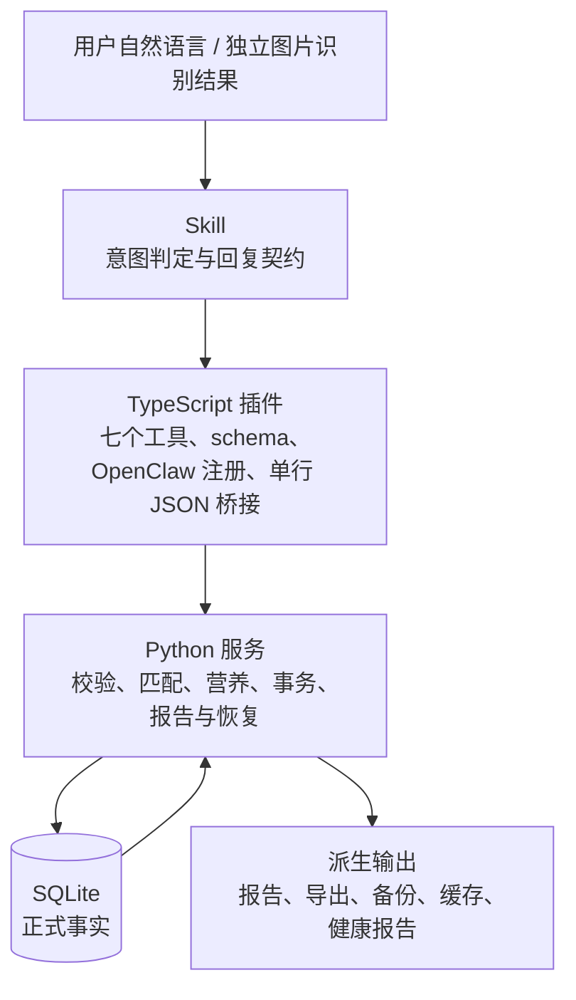
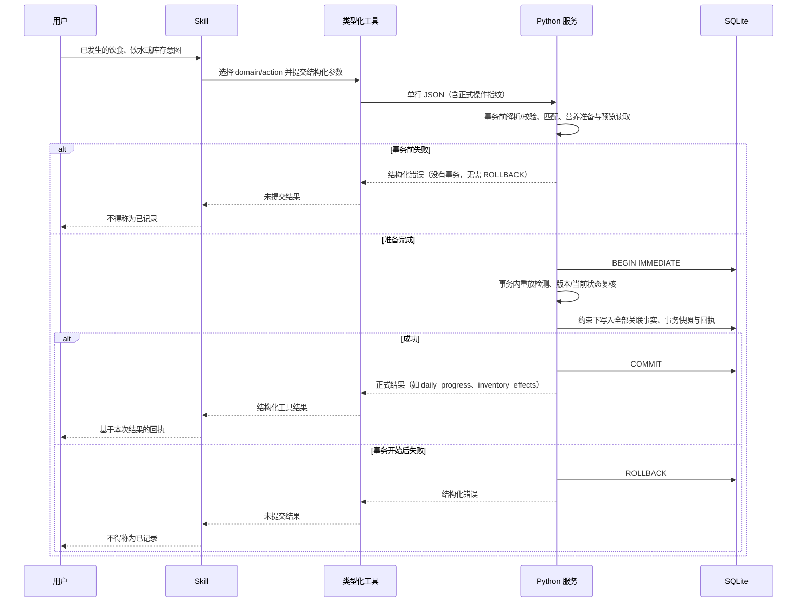
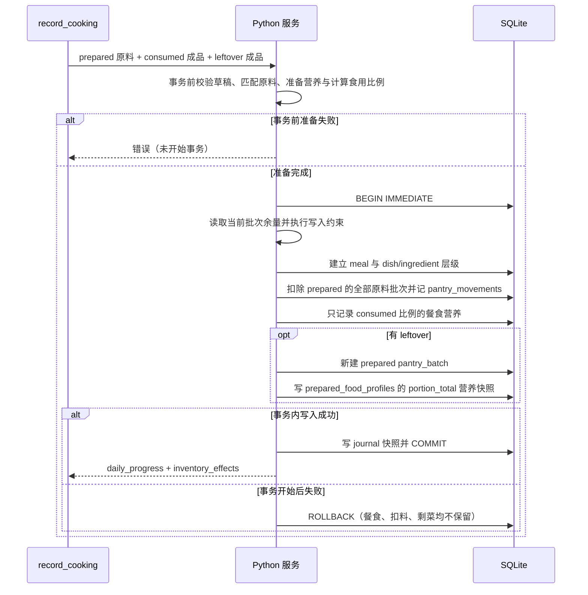

# 架构与正式写入

本文描述 Personal Diet Pantry v0.7.3.5 已实现的运行边界。它面向维护者：说明一项自然语言请求如何成为可审计的正式记录，以及哪些文件只是从正式记录派生出来的结果。

## 一条基本规则

**SQLite 是正式事实来源；Markdown 报告、导出、备份、缓存和健康报告都是可重新生成或恢复的派生输出。** 普通业务操作只能调用七个类型化工具：`diet_meal`、`diet_water`、`diet_weight`、`diet_pantry`、`diet_transaction`、`diet_report` 与 `diet_system`。不得通过直接读写 `diet.sqlite`、打开报告 Markdown/JSON、或扫描数据目录来绕过工具；工具返回值才是本轮操作是否已发生的依据。

图片识别不是本 Skill 的能力。独立图片识别 Skill 可以抽取候选标签、重量或营养信息；食序管家仍负责校验候选内容，并经自身工具写入正式事实。

## 五层边界

图中每层的输入、输出与职责如下；不能渲染 Mermaid 时，可按此表理解同一条链路。

| 层 | 输入 | 输出 | 职责与边界 |
| --- | --- | --- | --- |
| Skill | 用户表达与（可选）独立识别结果 | 选择后的工具调用、简洁回执 | 判定是否是已发生事件，遵守回复契约；不直接访问数据库或报告文件。 |
| TypeScript 插件 | 已类型化的工具参数与运行时身份 | 规范化 JSON 请求、用户可见工具结果 | 注册 OpenClaw 工具、执行 schema/输入限制与少量参数规范化；其内部 JSONL 适配组件启动 Python CLI、传递 `dataDir`，并要求标准输出恰好一行 JSON；对正式写入附加操作指纹，处理结果不确定的桥接失败。 |
| Python 服务 | domain/action/payload/context | 已提交结果、查询结果或结构化错误 | 分派业务动作，校验、别名/库存匹配、营养解析、预览、事务、报表与恢复。 |
| SQLite | 事务内的领域事实与迁移 | 约束后的持久化状态 | 保存库存、饮食、饮水、偏好、目标和事务事实；启用外键、WAL 与忙碌超时。 |
| 派生输出 | SQLite 中的正式行 | Markdown 报告、导出、备份、缓存、健康报告 | 供阅读、传递、备份或诊断；不反向成为事实来源。 |

这里严格只有五层：Skill、TypeScript 插件、Python 服务、SQLite 和派生输出。单行 JSON/JSONL 桥接是 TypeScript 适配层的内部组件，不是第六层。`src/index.ts` 注册的七类工具是唯一的业务入口。`contracts/tools.yaml` 是 action 与首选能力路线的机器事实源，生成 Skill 快速路线、TypeScript/Python action 清单和正式变更集合。`src/runtime-tool.ts` 将同一会话、语义动作族、来源文字、发生分钟和业务目标计算为语义指纹；`src/reliability.ts` 对正式写入附加操作标识与请求指纹。因超时或响应无效而无法确认结果时，它先查询操作状态，不能确认则要求查询当前状态，而不是盲目重试。

## 定向库存搜索与一次组合返回

普通库存识别从 `diet_pantry(search)` 开始，保留用户原始 `search_text`，依次使用规范名、静态或学习别名和索引关键词，并默认且最多返回 5 个聚合商品候选。只有用户明确要求浏览完整库存时才走分页 `query`。迁移 `020_inventory_search.sql` 提供搜索索引和 `pantry_product_reference` 预览类型；它不创建第二个数据库或新的营养事实副本。

候选携带短期、不透明的 `inventory_match_handle`。用户选定商品后，`diet_meal(record)` 在服务层核验句柄绑定的规范名与单位，并直接复用该身份执行现有的 opened-first、临期优先、入库时间顺序扣减；模型不需要也不允许再次按名称搜索。多个物理批次仍是一个聚合商品候选，多个不同商品才返回歧义。

营养档案、批次链接、批次独立快照和缓存继续规范化保存在同一个 `diet.sqlite`。`nutrition_mode=none | summary | full` 只是搜索响应的投影开关：默认 `none` 不读取营养，`summary` 在同一次搜索返回主要营养，`full` 仅用于用户明确要求完整标签。餐食消费已关联库存时，Python 服务在一次 `diet_meal` 调用内读取并缩放批次快照。

TypeScript 的餐食公共 Schema 使用单层、封闭且有界的餐项结构，避免 OpenClaw 模型侧归一化递归展开 `allOf/anyOf` 后膨胀到约 813 KB。按宿主实际归一化路径计算，模型侧预算小于 160,000 字节，同时保留全部餐食 action、液体体积、营养 basis 和直接证据字段。嵌套食材作为有数量上限的运行时输入，再由 TypeScript 与 Python 确定性校验跨字段关系和深度；这把模型兼容性与业务验证强度分开，而不是取消校验。

## 正式写入的时序与回执

正式写入包括餐食、饮水、库存、撤销/重做、偏好/目标和营养回填等会改变正式事实的动作。TypeScript 先校验和规范化输入。Python 服务随后在**事务前**完成适用的请求解析、业务校验、库存候选匹配、营养准备和预览读取；这些步骤失败时尚未执行 `BEGIN IMMEDIATE`，因此直接返回错误，不执行 `ROLLBACK`。进入 `TransactionManager.execute` 后才开始事务，并在事务内复核重放、预览/资源版本和当前状态，执行约束下的全部关联写入。只有 `COMMIT` 后才能回报“已记录”。

服务层的 `TransactionManager` 以 `BEGIN IMMEDIATE` 开始：先建立 `transactions` 的 pending 行，所有可变领域行必须经 `MutationContext` 写入；随后记录改动前后完整行快照、完成事务状态、写入操作回执并提交。只有进入这段事务后发生的异常才调用回滚；在 `execute` 之前的解析、校验或准备失败没有事务可回滚。事务日志使撤销和重做能先核对目标的状态与 generation，再安全地反向或重新应用快照；冲突不会静默覆盖较新的状态。

写入结果是回复的唯一来源。餐食成功结果可含 `daily_progress` 与 `inventory_effects`，进度工具直接从 SQLite 返回热量、蛋白、脂肪、碳水、纤维、钠和饮水七项进度。每项结果都受同一目标来源门控：`configuration_default` 不显示百分比或目标差距，只有 `user_confirmed` 才显示，并携带 UTC `confirmed_at`。不要在成功后为“确认”再查询完整库存，也不要读取 `reports/daily` 等派生文件来拼接回执。

## 做饭、食用与剩菜：一个原子边界

`diet_meal(record_cooking)` 将一次明确的做饭事件作为**一个**正式写入，而不是“记餐 + 扣库存 + 新增剩菜”的三个独立提交。输入中必须区分三类事实：

- `prepared`：完整成品所用的全部生食材和数量；
- `consumed`：这次实际吃掉的成品数量；
- `leftover`：存放的成品数量、位置和具体 `expires_at`。

例如，做六个煎蛋、吃四个、冷藏两个：原料蛋减少六个，餐食仅计四个的营养，两个成品成为新的冷藏库存批次。后续再吃这批剩菜时，系统按成品批次扣减，并按其 `portion_total` 营养快照按比例计算；**绝不再次扣减原来的生食材**。外食或外卖餐食则不扣家庭库存。

## 体重记录与滚动趋势

`diet_weight` 是独立领域，不混入餐食、饮水或营养报告。正式记录只接受重量、单位和可选状态；测量时间由 Python 服务在执行时从可信系统时钟生成，TypeScript schema 不暴露自定义时间字段。重量在 SQLite 中以整数克保存，公开响应转换为千克文本。

当前 7 日窗口与前一 7 日窗口直接从活动体重记录聚合。均值与差值在领域层统一保留 0.1kg，缺少对比窗口时省略趋势。查询、修改、删除以及撤销/重做均经过现有事务管理器；用户可见层只返回重量、时间、状态和统计，不暴露数据库 ID。

## 派生输出和维护职责

报告构建器只从 SQLite 行聚合并原子替换其 Markdown 结果；日、周、月报告、进度和行动洞察使用同一正式聚合口径。`insights` 是有日期、时区、临期窗口、数量与优先级上限的只读结构化查询，不读取报告文件。报告表现层按档案语言选择 `zh-CN` 或英文模板，未知语言确定性回退到英文。数据目录中的 `backups`、`exports`、`reports`、`cache` 与 `health-report.md` 都位于配置的 `dataDir` 内，路径解析会拒绝逸出数据根目录的目标。

维护时通过 `diet_system` 执行初始化、自检、修复、备份、恢复和配置。迁移、报表或备份机制是系统内部实现，不应被普通业务路径直接调用或替换。任何恢复后的业务读取也仍应走类型化工具。

v0.7.3.5 构建与源码操作不会自动部署。升级前应停止目标实例，并按[安装手册](INSTALLATION.zh-CN.md#5-备份用途与降级冷备份)使用随源码发布的 helper 保存包含已提交 WAL 数据的一致 SQLite 升级前冷备份。本版没有新增 migration，schema 与 v0.7.3.4 相同，因此停止实例后可直接安装 v0.7.3.4 代码并复用同一 `dataDir`。在线 `diet_system backup` 仍只用于同版本恢复；不得手工逆改迁移或 `schema_migrations`。

## 关联源码

- 工具注册、生成路由与边界：`contracts/tools.yaml`、`src/index.ts`、`src/reliability.ts`、`src/bridge.ts`。
- 服务分派及回执：`python/personal_diet_pantry/service.py`。
- 原子事务及撤销/重做：`python/personal_diet_pantry/transactions.py`。
- 剩菜成品快照：`python/personal_diet_pantry/prepared_foods.py`。
- 定向库存搜索：`python/personal_diet_pantry/inventory_matching.py`、`nutrition_profiles.py`。
- 数据库连接和迁移：`python/personal_diet_pantry/database.py`、`migrations/022_pantry_default_provenance.sql`。
