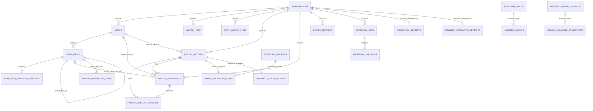
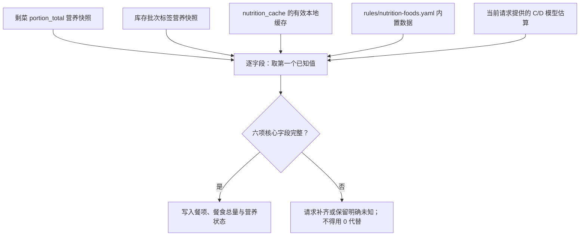

# SQLite 数据模型与事实来源

本文对应 Personal Diet Pantry v0.7.3.5 的迁移 `001` 至 `021`。v0.7.3.5 没有新增 migration，schema 与 v0.7.3.4 相同。本文说明当前正式 SQLite schema 的主要实体和关系，而不是复制完整建表 SQL。请通过类型化工具读写这些数据；普通业务不得直连 SQLite，也不得把 Markdown 报告、导出或缓存当作写入依据。

## 正式事实、快照与派生文件

SQLite 中的行是正式事实。`reports/` 下的日、周、月 Markdown 由正式餐食、饮水、库存变动、目标和偏好等行确定性生成；它们可重新生成，因此不是编辑或读取业务状态的接口。备份、导出、缓存和健康报告同样是派生或运维产物。

大多数可变领域记录带有 `transaction_id`，关联到事务日志；目标档案的该关联允许为空。餐食与饮水还可保存来源会话、模型和测试运行标识；它们用于可追溯性，不能作为用户可见的业务标识。

## 主要持久化实体

| 事实域 | 表 | 关键关系与内容 |
| --- | --- | --- |
| 事务审计与恢复 | `transactions` | 一次正式变更的类型、状态、来源文字、提交/撤销时间，以及改动前后 JSON 行快照；`generation` 用于撤销/重做的陈旧目标检测。 |
| 幂等与预览 | `operation_previews`、`operation_receipts`、`semantic_operation_receipts` | 预览保存哈希化一次性 token、请求/结果、资源版本、过期和消费状态；`pantry_product_reference` 保存短期商品选择，`prepared_food_reference` 保存精确熟食批次及营养快照版本。操作回执将请求或语义指纹唯一关联到正式事务，避免不确定重试重复写入。 |
| 可移植引用与删除凭证 | `portable_entity_handles`、`privacy_erasure_tombstones` | 导出为业务实体分配与数据库主键无关的稳定外部引用；彻底删除后只保留范围、数量、摘要、时间和被擦除引用，不保留被删除事实。 |
| 库存商品与物理批次 | `pantry_batches`、`pantry_movements` | `pantry_batches` 是可独立过期、存放、状态、剩余量和版本的物理批次，不等同于商品目录；迁移 020 的 `idx_pantry_batches_search` 支持定向候选查询。迁移 021 增加 `initial_display_quantity`、`display_unit`、`base_quantity_per_display_unit` 与 `package_hierarchy_json`，使包装展示与基础库存同时可审计。同一商品的多批次只在响应边界聚合，正式扣减仍写每个物理批次的 movement。 |
| 批次成本与浪费 | `pantry_batches`、`pantry_movements`、`pantry_cost_allocations` | 可选结构化批次价格以最小货币单位整数和三位大写币种成对保存；每次消费、浪费或盘点减少按当时剩余数量分摊成本，最后一次分摊吸收舍入余数，因此始终满足“原始成本 = 剩余成本 + 已分摊成本”。丢弃/过期可带浪费分类；普通盘点修正属于 adjustment，不伪装成 waste。旧版浮点 `price` 不猜测币种，也不自动转成结构化成本。 |
| 结构化营养档案 | `nutrition_profiles`、`pantry_nutrition_links`、`nutrition_cache` | 档案按规范名、品牌、产品键与版本保存结构化 JSON；一个批次最多链接一个档案，并保存当时的 `nutrition_snapshot_json`。`nutrition_cache` 是按规范名、品牌、计量基准缓存的本地营养来源，可过期。它们与库存批次仍规范化保存在同一个 `diet.sqlite`，`nutrition_mode` 只控制工具响应投影，不改变存储模型。 |
| 餐食及层级餐项 | `meals`、`meal_items` | 餐食保存发生时间、事件时区、本地日期、餐型、地点、各营养总量、营养状态、计算/来源状态、业务指纹、会话摘要和软删除时间。餐项以可空的 `parent_item_id` 表示 dish/ingredient 层级：顶层 food/dish 没有父餐项，ingredient 才关联父 dish；同时记录食用重量、体积、份数、生重、扣库存重量、可食比例、烹饪出成、营养字段、来源与不确定性。 |
| 营养计算证据 | `meal_item_nutrition_evidence` | 每个餐项最多一条证据，保存 `per_100g`、`per_100ml`、`per_serving` 或 `consumed_total` 口径、规范化输入事实、缩放系数、来源等级、数据/规则版本、份量证据、计算/来源状态和警告；该行跟随餐食事务撤销与重做。 |
| 做饭剩菜 | `prepared_food_profiles` 与 `pantry_batches.source_meal_id` | 剩菜仍是一个库存批次；只有做饭产生的成品批次通过 `source_meal_id` 关联来源餐食，普通入库批次的该字段为空。`prepared_food_profiles` 保存 `portion_total` 营养 JSON、初始数量、单位、来源等级和创建时间。 |
| 饮水 | `water_logs` | 独立的纯饮水事件，保存发生时间、毫升、来源文字与软删除时间；餐食中的水分由 `meals.total_hydration_ml` 和 `meal_items.hydration_ml` 表达，不应重复成普通饮水事件。 |
| 体重 | `body_weight_logs` | 保存系统生成的 UTC 测量时间、整数克重量、可选自由状态、单调递增资源版本、审计时间、软删除时间和事务关联。主键不复用，资源版本每次修改递增，避免旧句柄落到新事实。重量限制为 5–500kg，状态最多 80 字符；7 日均值与趋势在查询时聚合，不重复保存为事实。 |
| 菜谱档案 | `recipe_profiles` | 保存用户明确要求复用的菜谱名称、1–30 个结构化原料、产量、单位、备注、来源文字和资源版本。菜谱是可复用配置，不是历史餐食；推荐只读取菜谱与当前库存，不产生餐食或库存事实。 |
| 购物清单 | `shopping_lists`、`shopping_list_items` | 预览确认后才持久化清单及条目；清单保存 active/cancelled/completed 状态，条目保存 pending/purchased/cancelled 状态。购物条目与物理库存严格分离：即使条目将来标记 purchased，也不能自动创建 `pantry_batches`。 |
| 偏好、别名与份量 | `personal_rules`、`learning_events` | `personal_rules` 保存 food_alias、portion、meal_type、inventory_link 与 preference 等规则及激活状态；`learning_events` 把证据事件关联到规则。 |
| 目标与历史完整性 | `nutrition_goal_profiles`、`pending_inventory_links` | 单例目标档案（`id = 1`）保存热量、蛋白质、脂肪、碳水、膳食纤维、钠和饮水七项目标，另有时区、`goal_source` 与 `confirmed_at`。来源只允许 `configuration_default` 或 `user_confirmed`；确认时间使用 UTC，默认目标为 `NULL`。餐食的 `nutrition_status` 为 complete/partial/incomplete，`nutrition_missing_fields_json` 明确未知字段；待确认库存链接单独保存，不把猜测伪装成确定扣减。 |
| schema 演进 | `schema_migrations` | 已应用版本、迁移文件名、应用时间和 checksum；它保护已部署 schema 不被静默改写。 |

`meals`、`meal_items` 的营养数值在当前 schema 中使用受约束的非负十进制文本，避免二进制浮点表示误差。未知值保持 `NULL`；没有营养数据绝不等于营养为零。

餐食的 `intake_fingerprint` 是由稳定业务事实形成的 SHA-256 摘要，用于阻止确认、重连或重试产生重复活动餐食。新写入的 `source_session_hash` 只保存完整会话键的 SHA-256 摘要，不能逆向作为会话凭据；迁移 014 会从现有餐食、饮水及事务快照中清除旧版完整会话键，但不会猜测性补造历史摘要。两者都是内部幂等/审计字段，不是用户标识。

餐食的 `nutrition_status` 表达字段完整性，`nutrition_calculation_status` 表达计算是否通过约束校验，`nutrition_provenance_status` 表达来源证据能否追溯；三者不能互相替代。旧数据在没有新证据时保持 `unverified`/`untraceable`，不会在迁移中被猜测性重算。

## 营养来源优先级

餐项按字段合并来源：高优先级来源提供一个字段后，低优先级只能补齐仍为未知的字段，不能覆盖已知值。合并后的完整性由六项核心字段（热量、蛋白质、脂肪、碳水、膳食纤维、钠）决定；缺失字段会被显式记录。

优先级从上至下严格为：

1. 剩菜的 `prepared_food_profiles.nutrition_json` 快照；
2. 库存批次已链接标签的 `pantry_nutrition_links.nutrition_snapshot_json`；
3. 未过期的 `nutrition_cache`；
4. 内置 `rules/nutrition-foods.yaml`；
5. 当前请求携带的 C/D 模型估算。

剩菜快照按“所选成品数量 ÷ 初始剩菜数量”缩放；批次标签快照按其服务基准计算。缓存、内置资料与当前估算也按字段补齐，而不是整体替换。日、周、月报告与 `diet_report(progress)` 都使用同一个 SQLite 聚合逻辑；若历史餐食有未知营养，聚合展示的是已知下界并保留不完整信息，不将未知当作零。

## 事务、撤销与重做

正式写入由 `TransactionManager` 先创建 pending 事务，再以受限 `MutationContext` 修改允许的表，记录完整 before/after 快照，最后提交。回滚会撤去本次所有关联行。撤销从原事务的 after 状态反向应用回 before 状态；重做再由 before 应用到 after。两者都会核验预期状态与 generation，并在数据被其他操作改变时失败，而非覆盖变化。

这意味着“当前库存”“报告结果”并不是事务日志的替代品：库存是当前状态，事务快照是恢复和审计依据，报告只是查询时的可再建呈现。

## 迁移与 checksum

迁移文件按数值版本排序，由 `database.apply_migrations` 在一个 `BEGIN IMMEDIATE` 中应用。服务会先读取 `schema_migrations`，验证每个既有版本仍存在、文件名相同且 checksum 与原记录相符；随后只执行未应用的迁移，并写入版本、文件名、时间与 checksum。任何异常都会回滚整个迁移批次。

checksum 的规范值是迁移内容经 LF 换行归一化后的 SHA-256；为了兼容既有部署，检查同时接受原始、LF 归一化和 CRLF 形式的哈希。已应用的迁移不可编辑、改名、删除或手工篡改 checksum；需要演进 schema 时添加新的编号 SQL 迁移。

| 版本 | 迁移要点 |
| --- | --- |
| 001 | 建立事务、餐食/餐项、饮水、库存批次/变动、营养缓存、规则/学习、待确认链接、预览和 `schema_migrations`。 |
| 002 | 为常用事务、餐食、库存和缓存查询增加索引。 |
| 003 | 将餐食及餐项营养与置信度改为精确十进制文本。 |
| 004 | 重建餐食与餐项以加入 parent/dish/ingredient 层级、显示顺序、营养来源/不确定性；库存变动可关联具体餐项。 |
| 005–007 | 扩展服务工作流预览类型与索引，加入请求回执和事务 generation。 |
| 008–010 | 增加批次重量元数据、版本化营养档案及批次快照链接、剩菜成品档案与餐食水分字段。 |
| 011 | 加入餐食营养状态/缺失字段、餐食和饮水来源元数据、单例营养目标档案和语义操作回执，并回填既有餐食状态。 |
| 012 | 为目标档案加入受约束的 `goal_source` 和 UTC `confirmed_at`；旧目标迁移为 `configuration_default`，不会被推断为用户已确认。 |
| 013 | 加入餐食事件时区、本地日期、业务指纹、会话摘要和计算/来源状态；加入餐项食用体积、份数及一餐项一条的营养计算证据表和相关索引。 |
| 014 | 在不修改已发布 013 校验和的前提下，清除旧餐食、饮水和事务快照中的完整会话键。 |
| 015 | 新增体重正式事实表及活动记录时间索引，并扩展操作预览以支持不透明体重引用；保留既有预览行。 |
| 016 | 新增菜谱档案、购物清单及条目，并扩展操作预览以支持购物清单的精确 preview/commit 和不透明引用；不把购物状态写成库存。 |
| 017 | 为库存批次新增最小货币单位价格、币种和剩余成本；新增成本分摊事实与浪费分类。历史浮点价格保持原值且不猜测币种；成本报告始终按币种分别聚合。 |
| 018 | 新增可移植实体引用与隐私删除凭证，并扩展预览类型以支持导入和精确删除。迁移本身不导出、不导入、不删除业务事实。 |
| 019 | 新增可信维护工作流所需的控制操作引用、快照状态和唯一性约束；旧行保持兼容。 |
| 020 | 新增 `idx_pantry_batches_search` 复合索引，并在保留旧预览数据的前提下重建 `operation_previews`，加入 `pantry_product_reference` 类型。该迁移不复制营养档案、不自动创建候选或扣减库存。 |
| 021 | v0.7.3 已有迁移：为库存批次增加包装展示数量、展示单位、单包装基础数量和包装层级；旧批次保持未知而不猜测回填。重建 `operation_previews` 以加入精确熟食引用，同时保留已有受信工作流。v0.7.3.1、v0.7.3.2、v0.7.3.3、v0.7.3.4 与 v0.7.3.5 均复用该迁移。 |

数据库连接开启外键、WAL 和 5 秒忙碌超时；自检使用 SQLite `integrity_check` 与 `foreign_key_check`。这两项检查和迁移 checksum 检查均应通过 `diet_system` 的维护路径触发，而不是由普通业务直接执行 SQL。

## 关联源码

- 初始 schema 与迁移：`migrations/001_initial.sql` 至 `migrations/021_package_semantics_and_product_operations.sql`。
- 连接、校验与 checksum：`python/personal_diet_pantry/database.py`。
- 事务快照、撤销和重做：`python/personal_diet_pantry/transactions.py`。
- 库存定向匹配与句柄复用：`python/personal_diet_pantry/inventory_matching.py`、`service.py`。
- 包装语义与商品级换算：`python/personal_diet_pantry/package_semantics.py`、`pantry.py`。
- 营养合并：`python/personal_diet_pantry/meals.py`、`nutrition.py`、`nutrition_resolution.py`、`nutrition_profiles.py`、`prepared_foods.py`。
- 报表与聚合：`python/personal_diet_pantry/reports.py`、`progress.py`、`costs.py`、`waste.py`、`trends.py`。
- 体重记录与滚动趋势：`python/personal_diet_pantry/body_weight.py`。
- 菜谱推荐与购物清单：`python/personal_diet_pantry/recipes.py`、`shopping.py`。
- 历史营养只读审计：`python/personal_diet_pantry/nutrition_audit.py`。
- 数据导出、校验导入与删除：`python/personal_diet_pantry/data_export.py`、`data_import.py`、`data_erasure.py`。
- 隐私分级、脱敏与 CSV 安全：`python/personal_diet_pantry/privacy.py`。
